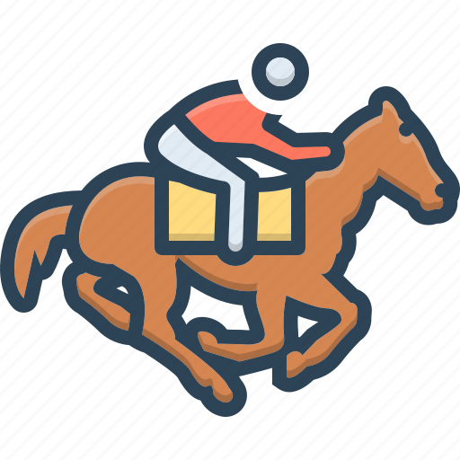

  

  <h3 align="center">Horse-Racing</h3>
  
A browser game where you bet on horses — with play money, not real money.

## About

A small horse-racing game that runs entirely in the browser. Place a bet on a horse, watch the
race play out, and if your horse wins you get a payout; if it loses, you lose your stake. It's a
long-running personal project that I keep tweaking and adding features to.

## Tech

- Plain **HTML**, **CSS**, and **JavaScript** — no build step, no dependencies.

## Run

1. Clone this repository.
2. Open `index.html` in your web browser.
3. Pick a horse, place your bet, and start the race.

## Contributing

Contributions are welcome — fork the repository, make your changes, and open a pull request.

## Useful references

Links that helped while building this:

- [Add a delay in a JavaScript loop](https://stackoverflow.com/questions/3583724/how-do-i-add-a-delay-in-a-javascript-loop)
- [Check whether a radio button is selected](https://www.geeksforgeeks.org/how-to-check-whether-a-radio-button-is-selected-with-javascript/)
- [oninput event of number inputs](https://www.w3schools.com/jsref/tryit.asp?filename=tryjsref_oninput)
- [for loops with document.getElementById](https://stackoverflow.com/questions/26847366/for-loop-in-javascript-document-getelementbyid)
